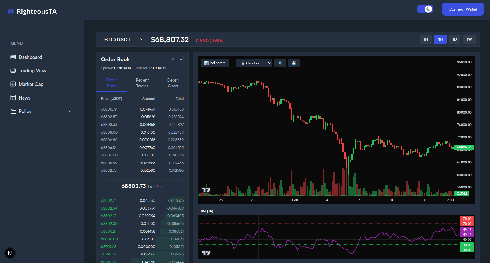
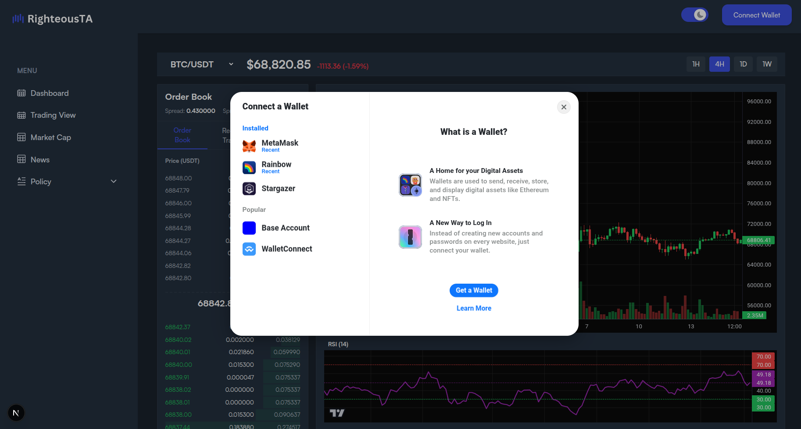

# RighteousTA – Crypto Technical Analysis Platform

[](LICENSE)
[](https://nextjs.org/)
[](https://www.typescriptlang.org/)
[](https://tailwindcss.com/)

**Live Demo:** [https://www.righteousta.com/](https://www.righteousta.com/)





RighteousTA is a modern cryptocurrency technical analysis platform built to help traders and analysts track markets, visualize data, and learn TA concepts in real time.

## Features

- **Live Market Cap Rankings** – Top 100 cryptocurrencies with real-time USD/BTC prices, 24h changes, and market data (CoinGecko API)
- **Trading Dashboard** – Order book, live price stats, market heatmap, and TradingView-powered charts
- **Wallet Connection** – Connect Ethereum wallets via **Wagmi + RainbowKit + Viem** (MetaMask, WalletConnect, Rainbow, etc.)
  - Displays ENS name (if available), shortened address, and ETH balance
  - Custom dropdown with Etherscan link, copy address, and disconnect
- **Dark/Light Mode** – Full theme support with persistent preference
- **Responsive Design** – Clean UI on desktop, tablet, and mobile (Tailwind CSS)
- **News & Education** – Crypto news feed and upcoming TA learning resources

## Tech Stack

- **Frontend**: Next.js 15 (App Router), React 18, TypeScript
- **Styling**: Tailwind CSS (custom theme with dark mode)
- **State & Data Fetching**: React hooks, TanStack Query (for API caching)
- **Web3**: Wagmi, Viem, RainbowKit (wallet connection & blockchain interaction)
- **Charts**: TradingView Lightweight Charts, Lightweight Charts
- **Icons/Visuals**: Jazzicon (dynamic wallet avatars), Lucide icons
- **API**: CoinGecko (real-time prices, market data, historical charts)

## Quick Start (Local Development)

```bash
# Clone the repo
git clone https://github.com/austinmargarone/righteous_ta.git
cd righteous_ta

# Install dependencies
npm install

# Copy .env.example to .env.local and fill in your WalletConnect Project ID
cp .env.example .env.local

# Start development server
npm run dev

## Contact

For questions or support, please contact Austin Margarone at austin@margarone.dev.
```
